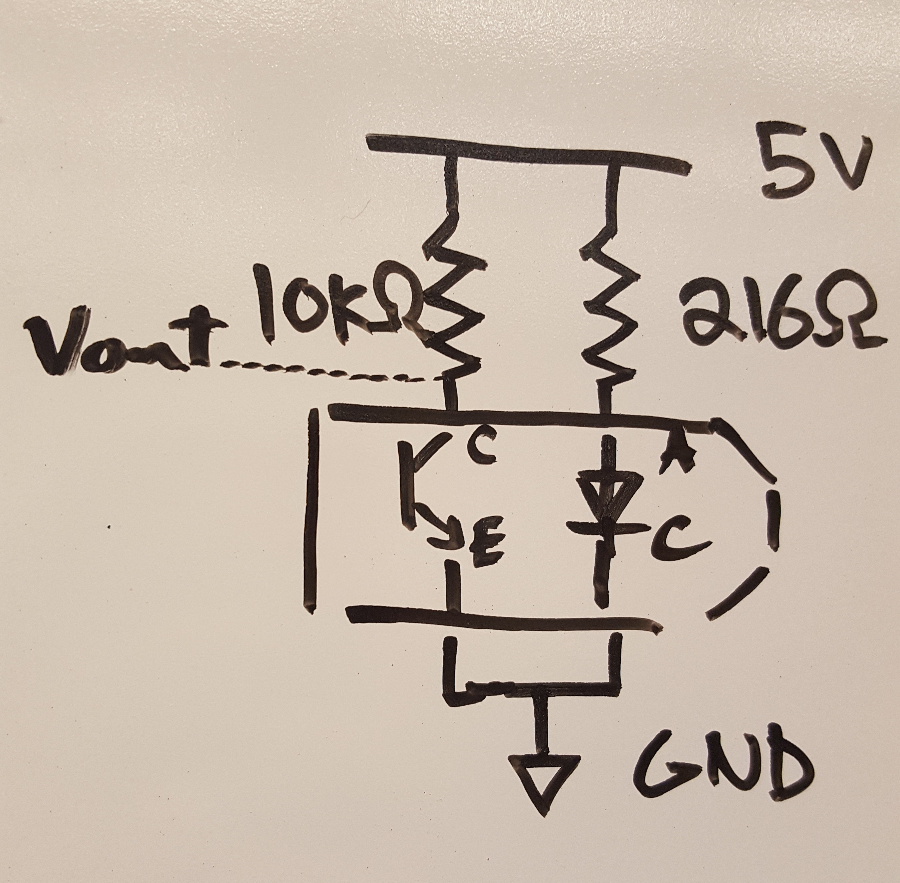
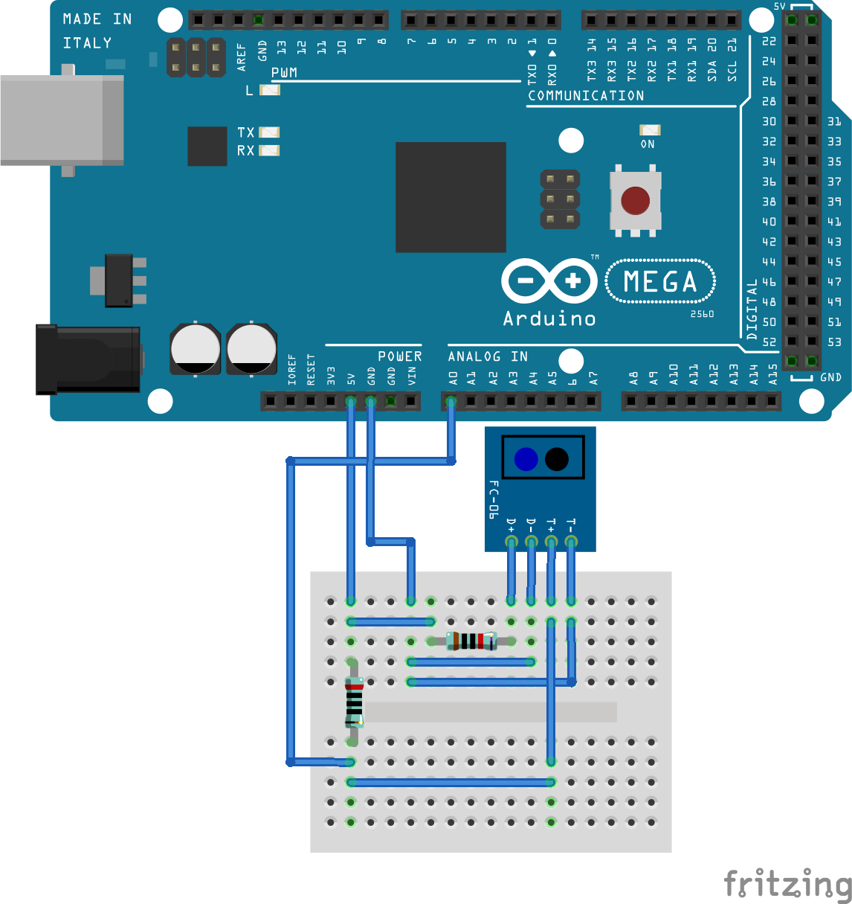

# POE-lab3

Code and results for Lab 3 of POE at Olin College, Fall 2016

# Current Todos :

Jamie :

- [ ] Redesign IR Mounts
- [x] Simulator with Higher Fidelity HW Interface
- [x] Characterize Motors, Velocity-Voltage
- [ ] Autocalibration
- [ ] On-Off Switch (might as well be E-STOP)

Eric :

# IR Reflectance Sensor Wiring Diagram

# Connecting to Arduino

