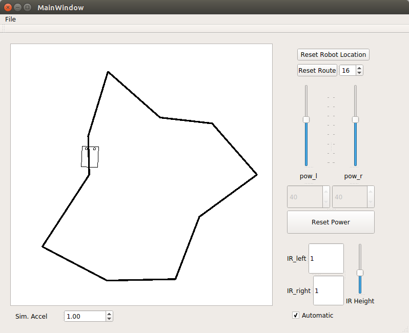

# POE-lab3 : Simulation : Autonomy

[Demo Video](https://youtu.be/jBecrwmV3AQ)

Code and results for Lab 3 of POE at Olin College, Fall 2016

# Current Todos :

Jamie :

- [ ] Redesign IR Mounts
- [x] Simulator with Higher Fidelity HW Interface
- [x] Characterize Motors, Velocity-Voltage
- [ ] Autocalibration
- [ ] On-Off Switch (might as well be E-STOP)
- [ ] Voltage Monitor (differentiate USB vs. Outlet power?)

Eric :

- [x] Build data structures for storing path data
- [ ] Integrate motor characterization into kinematics model
- [x] Record line-followed path
- [x] Play back recorded path losslessly
- [ ] Hybridize path following and line following
- [ ] Make framework for segmented paths (using turns as odometry resets)
- [x] Build state machine in code for handling training/replaying
- [ ] Precompile known path into memory for competition


# IR Reflectance Sensor Wiring Diagram



### Build

```bash
cd LineFollowerSimulator
qmake -qt=qt5 LineFollowerSimulator.pro
make
```

### Run

```bash
./LineFollowerSimulator
```

#### Control

Up/Down Arrow Keys for controlling left motor power
Left/Right Arrow Keys for controlling left motor power

Alternatively, you can also use the slider.

Clicking on "Reset Power" sets the robot's velocity to 0.

#### Routes

You can reset routes by specifying the number of junctions in the spin-box.

Currently, the routes cannot be saved (feature to be implemented)

#### IR Sensor Reading

On the bottom-right text box, you can see the reading from the IR sensor.
1 is white and 0 is black; anywhere in the middle is a grey zone.
Normalize your inputs as necessary and run your code!

You may also adjust the height of your IR sensor to increase the size of your conical projection..

#### Autonomy

You can toggle "autonomy" option, which will make the robot follow the route on itself!
